# ZENCRM – Mini CRM Platform 🚀

Welcome to ZENCRM! This is a modern, full-stack mini CRM platform built for the Xeno SDE Internship assignment. ZENCRM empowers you to segment customers, deliver personalized campaigns, and gain actionable insights—all with a clean, intuitive experience.

---

## ✨ Key Features
- **Secure REST APIs** for ingesting customers and orders (with Swagger UI docs)
- **Dynamic Campaign Builder** with flexible AND/OR rule logic
- **Audience Preview** before saving segments
- **Campaign History** with delivery stats (sent, failed, audience size)
- **Personalized Campaign Delivery** with simulated vendor API 
- **Delivery Receipt API** for real-time status updates
- **Google OAuth 2.0 Authentication**
- **Rule-Based Message Suggestions** (context-aware, up to 6 variants per campaign)
- **Clean, Intuitive UX** (React + Material UI)
- **Deployed on Vercel (frontend) & Render (backend)**

---

## 🏗️ Architecture Diagram
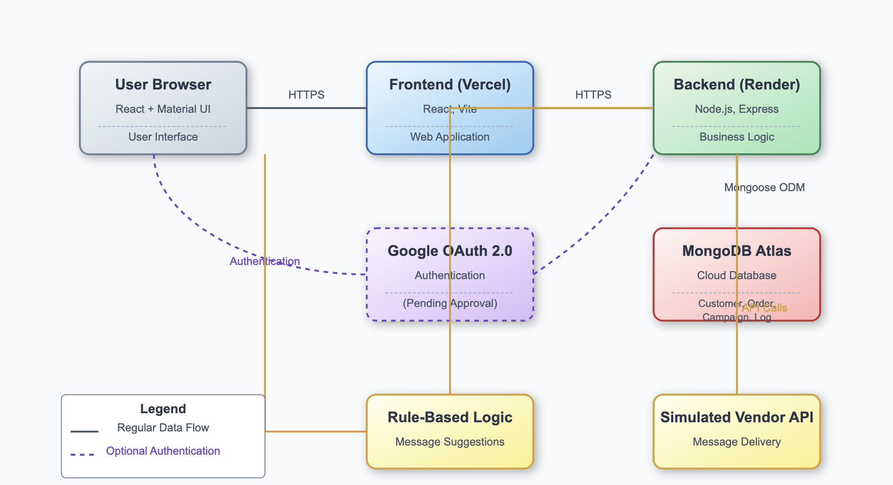

---

## 🖥️ Screenshots & Walkthrough

1. **Login Page**
   - 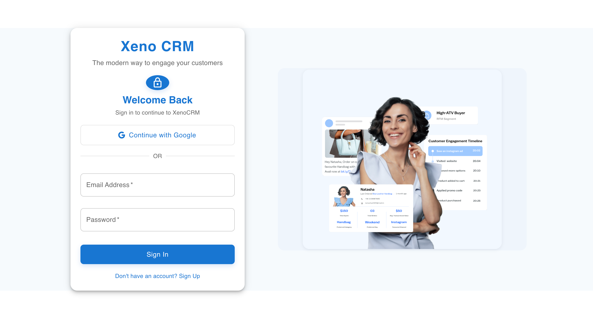
2. **Home Page**
   - 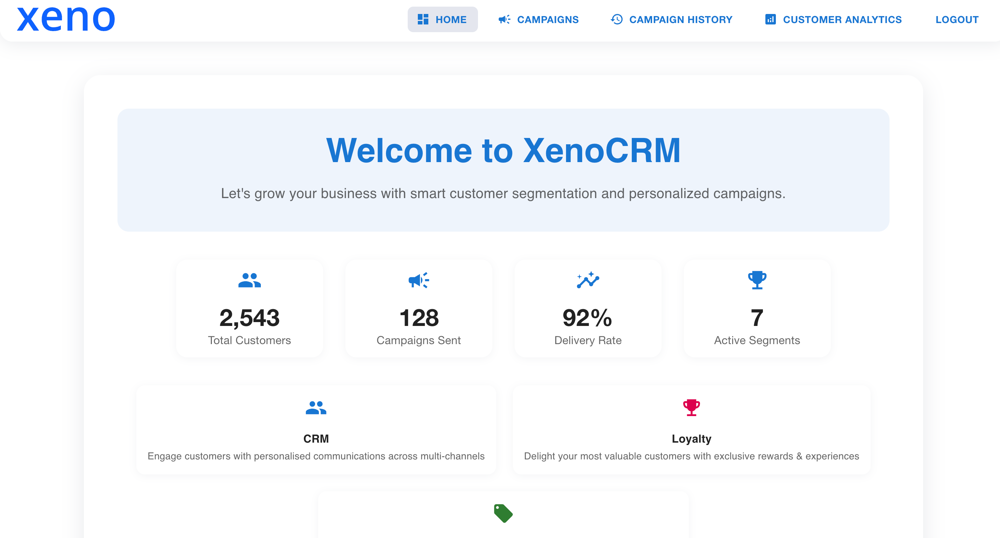
   - 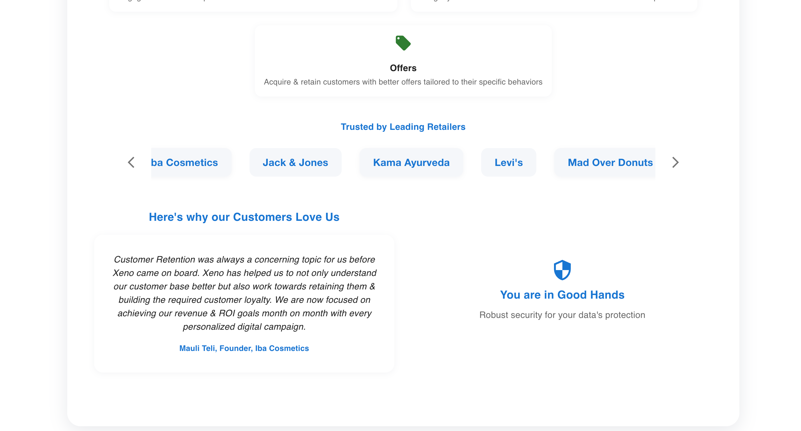
3. **Create Campaign**
   - 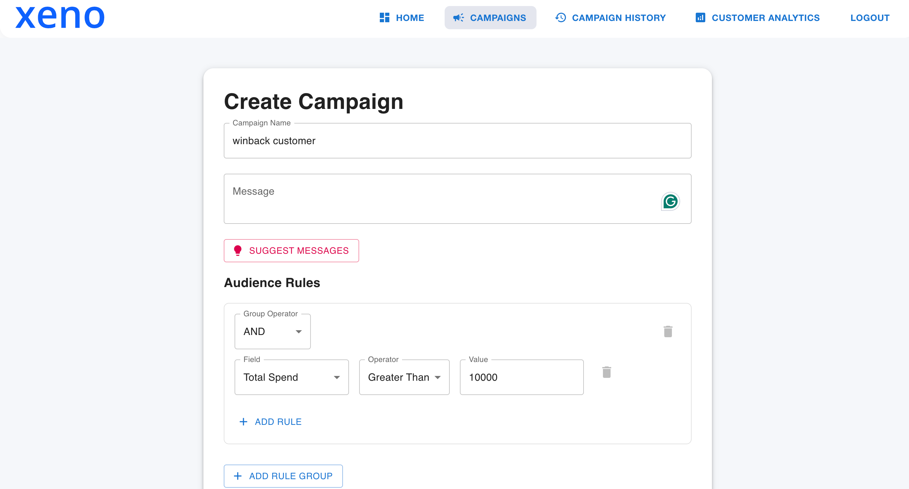
4. **AI Message Suggestion for Inactive Customer**
   - 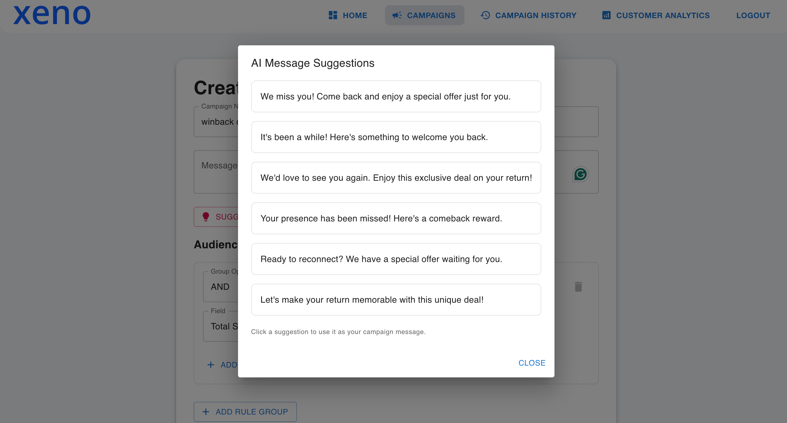
5. **AI Message Suggestion for Loyal Customer**
   - 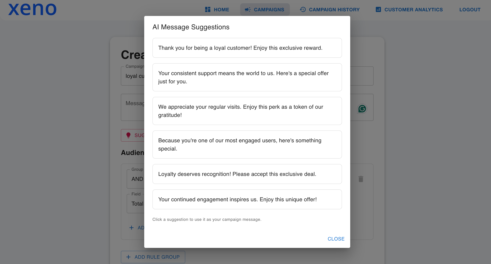
6. **Rule Building for Campaign**
   - 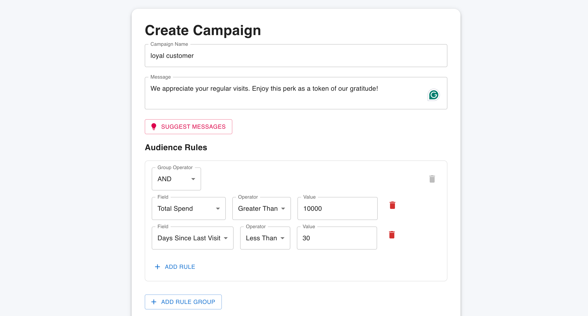
7. **Audience Preview (Based on Rule)**
   - 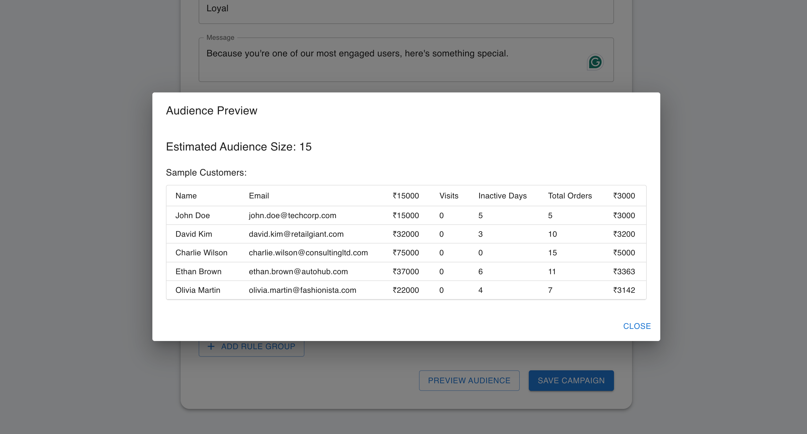
8. **Campaign Preview**
   - 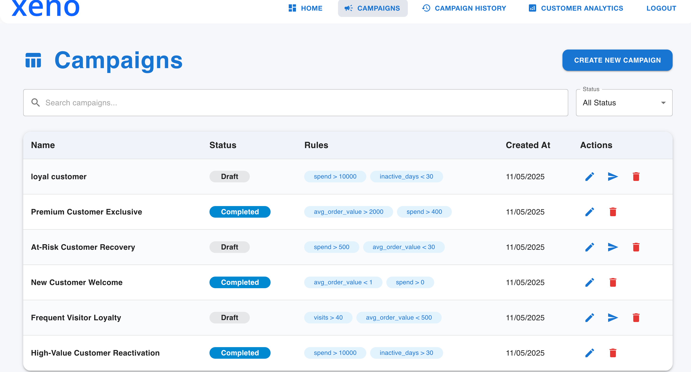
9. **Sending Message**
   - 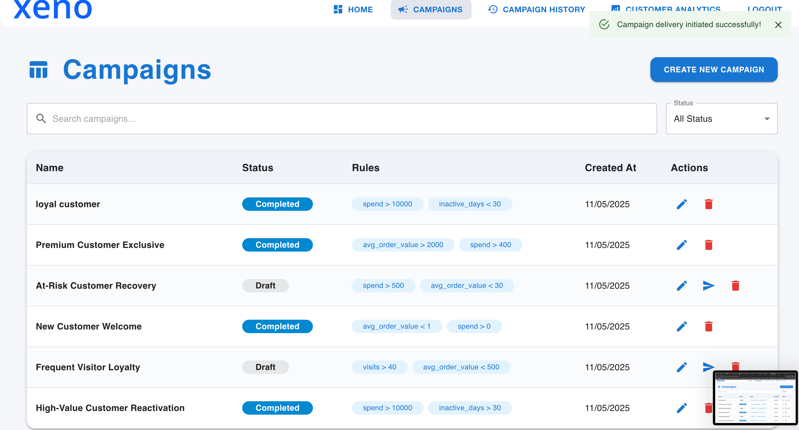
10. **Campaign History with Stats and Details**
    - 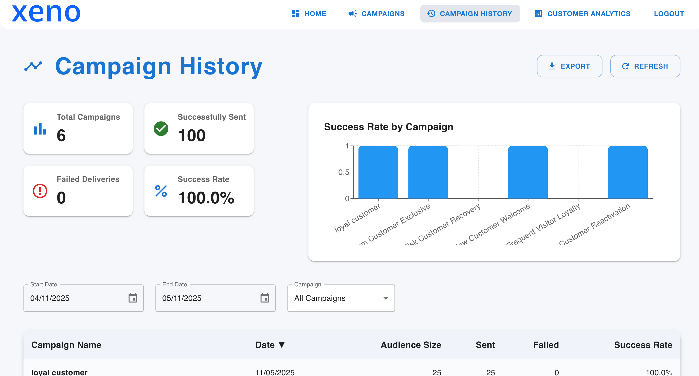
    - 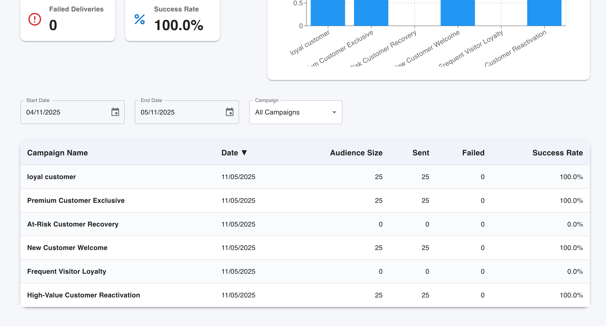
11. **Customer Analytics Dashboard**
    - 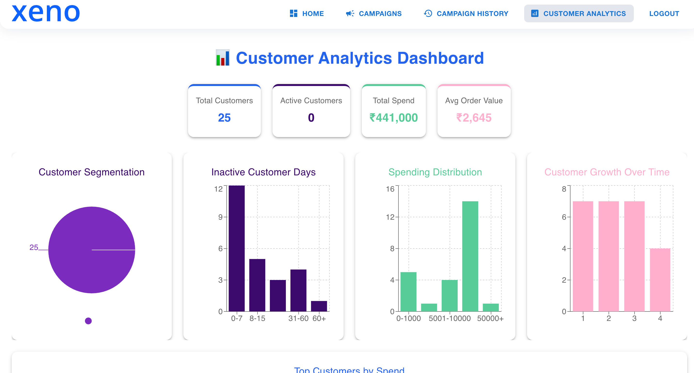
    - 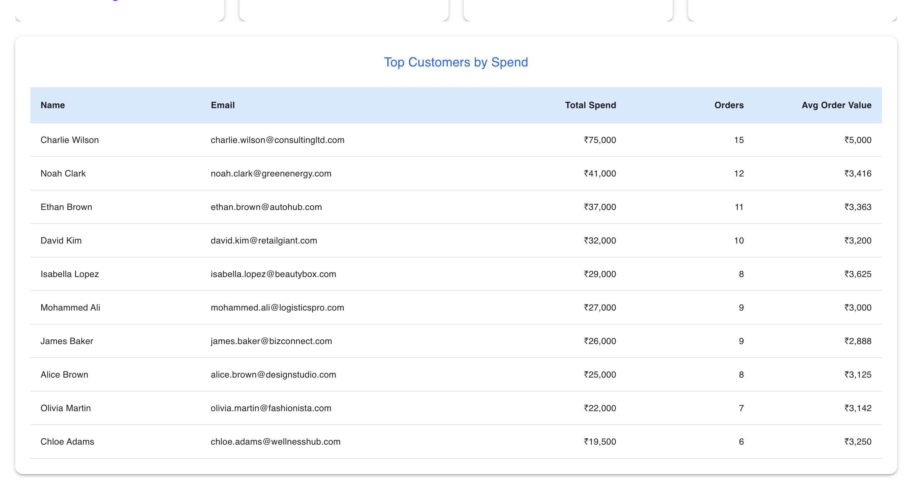

---

## 🛠️ Tech Stack
- **Frontend:** React.js (Vite, Material UI)
- **Backend:** Node.js (Express)
- **Database:** MongoDB Atlas
- **Authentication:** Google OAuth 2.0 
- **Deployment:** Vercel (frontend), Render (backend)

---

## 🧠 Smart Features
- **Rule-Based Message Suggestions:**
  - Context-aware suggestions based on campaign objective (up to 6 variants)
  - Keyword mapping for loyalty, winback, new, premium, and discount campaigns
  - No external AI/LLM APIs used; logic is fully rule-based and easily extendable

---

## 🔒 Authentication
- Google OAuth 2.0 integration 

---

## 📦 API Documentation
- Swagger UI available at `/api-docs` (backend)
- Example requests and responses for all endpoints

---

## 🏃‍♂️ Local Setup Instructions
1. **Clone the repo:**
   ```bash
   git clone https://github.com/prashx1908/ZENCRM.git
   cd ZENCRM
   ```
2. **Backend:**
   ```bash
   cd ZENCRM-backend
   npm install
   # Set up .env with MongoDB URI, JWT secret, Google OAuth keys
   npm run dev
   ```
3. **Frontend:**
   ```bash
   cd ../ZENCRM-frontend
   npm install
   npm run dev
   ```

---

## 🌐 Deployment
- **Frontend:** [Vercel Deployment Link](https://ZENCRM-mu.vercel.app)
- **Backend:** [Render Deployment Link](https://ZENCRM-backend.onrender.com)

---

## 📝 AI Tools & Tech Used
- All message suggestions are generated using custom rule-based logic

---

## ⚡ Known Limitations / Assumptions
- No pub-sub architecture (Kafka, RabbitMQ, etc.) implemented
- Vendor API is simulated for demo purposes
- UI/UX is optimized for desktop
- No external AI/LLM APIs used

---

## 🙏 Thank You!
Thank you for reviewing my submission! If you have any questions, feel free to reach out. I'm excited to discuss my approach and learn more about Xeno. 🚀
